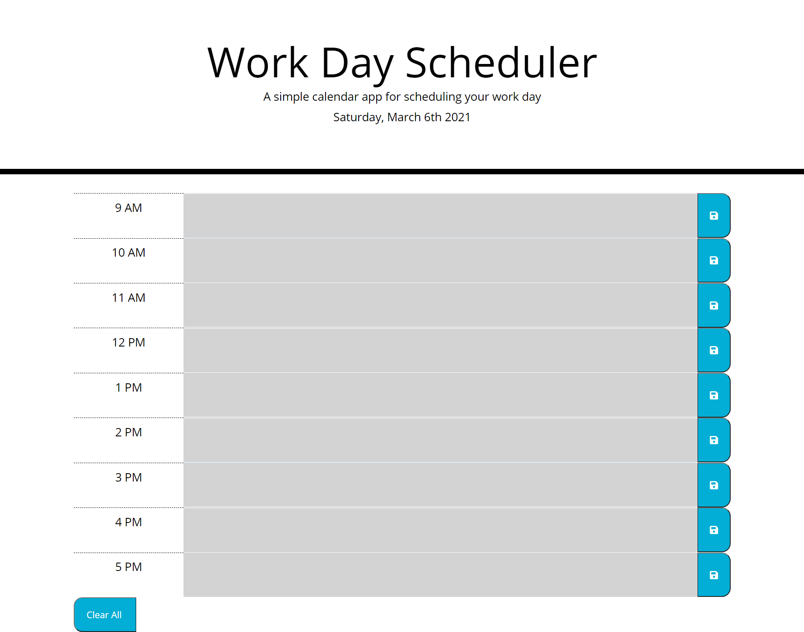

# Work-Day-Scheduler-

## Description
In order to manage my time more effectively, I want to add events to a daily planner. At the top of the
planner, the current date is displayed. Timeblocks that represent the time from 9AM to 5pm are displayed so that one can input text for a task into each time. Pressing the save button on the right side will allow a person to save their task to local storage. If they refresh the page, they should be able to still see their saved task. The timeblocks are supposed to change depending on the time, though I had some difficulties implementing this feature. A clear button was added so that the localStorage could be cleared if needed.

## Link to Deployed Application
https://tjl2125.github.io/Work-Day-Scheduler-/

## Screenshot 
 
